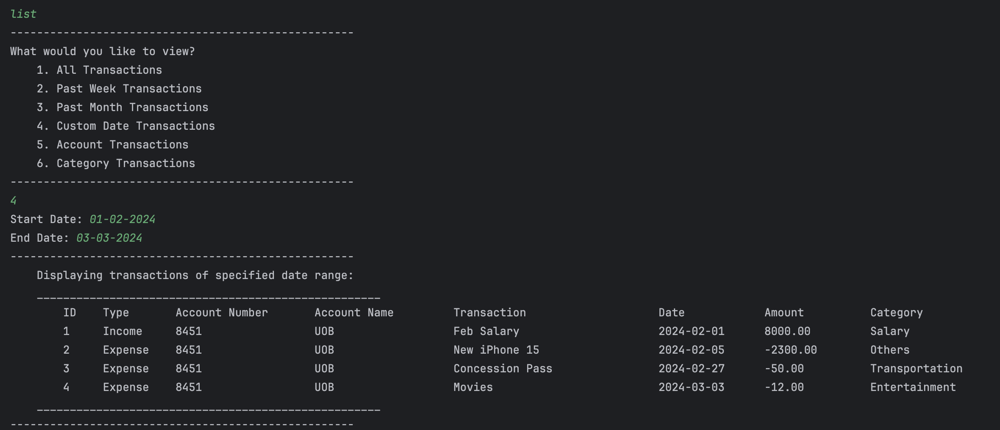

# User Guide

## Table of Contents
- [Introduction](#introduction)
- [Quick Start](#quick-start)
- [Features](#features)
  - [Viewing help: `help`](#viewing-help-help)
  - [Adding a transaction: `add`](#adding-a-transaction-add)
  - [View transaction history: `list`](#view-transaction-history-list)
  - [Deleting a transaction: `delete`](#deleting-a-transaction-delete)
  - [Edit a transaction: `edit`](#edit-a-transaction-edit)
  - [Search for a transaction: `search`](#search-for-a-transaction-search)
  - [Add an account: `add-acc`](#add-an-account-add-acc)
  - [List all accounts: `list-acc`](#list-all-accounts-list-acc)
  - [Delete an account: `delete-acc`](#delete-an-account-delete-acc)
  - [Edit an account: `edit-acc`](#edit-an-account-edit-acc)
  - [View transaction insights: `insights`](#view-transaction-insights-insights)
  - [Exiting the program: `bye`](#exiting-the-program-bye)
  - [Saving the data](#saving-the-data)
  - [Editing the data file](#editing-the-data-file)
- [FAQ](#faq)
- [Command Summary](#command-summary)

## Introduction

BudgetBuddy is a **desktop app for managing personal finances, optimized for use via a Command Line Interface** (CLI).
It offers the tracking of income and expenses of multiple accounts and even provides insights of your financial
activities.

## Quick Start

1. Ensure that you have Java `11` or above installed.
2. Down the latest version of `budgetbuddy.jar`
   from [here](https://github.com/AY2324S2-CS2113-T15-2/tp/releases/latest).
3. Copy the file to the folder you want to use as the _home folder_ for your BudgetBuddy.
4. Open a command terminal, `cd` into the folder you added the jar file to, and use the `java -jar budgetbuddy.jar`
   command to
   run the application.
5. When the application is **first run**, BudgetBuddy will prompt the user to **create a new account**, prompting the
   user to
   add an **account name** and **initial balance**. Type the details in the terminal and press Enter to confirm.
6. Subsequently, users may type the command into the terminal and press Enter to execute it. e.g. typing **`help`** and
   pressing
   Enter will prompt the help feature.
7. Refer to the [Features](#features) below for details of each command.

## Features

> [!NOTE]
> **The following are notes about the command format:**
* Words in `UPPER_CASE` are the parameters to be supplied by the user.
  e.g `delete TRANSACTION_ID`, `TRANSACTION_ID` is a parameter which can be used as `delete 1`
* Parameters can be in any order.
  e.g if the command specifies `/n/ACCOUNT_NAME /$/INITIAL_BALANCE`, `/$/INITIAL_BALANCE /n/ACCOUNT_NAME` is also acceptable.
* Extraneous parameters for commands that do not take in parameters (such as `help`, `list`, `list-acc` and `bye`) will be ignored.
  e.g if the command specifies `help abc`, it will be interpreted as `help`.

### Viewing help: `help`

Shows the instructions for using BudgetBuddy.  

This command gives the list to search for commands, specific for each task. The commands `help all` and
`help acc` covers the basic structure of all commands. Instructions for command-specific help will be
provided in the `help all` and `help acc` accordingly.

**Format:** `help`   

### Adding a transaction: `add`

Adds a transaction into the transaction list of the specified account.

**Parameters:** Account Number, Transaction Type, Name, Amount, Date, Category

**Format:** `add /a/ACCOUNT_NUMBER /t/TRANSACTION_TYPE /n/NAME /$/AMOUNT /d/DATE /c/CATEGORY`

* The `ACCOUNT_NUMBER` can be viewed using the command `list-acc`.
* The `TRANSACTION_TYPE` includes **Expense** or **Income** ONLY.
* The `AMOUNT` is in dollars ($).
* The `DATE` should be in the format **DD-MM-YYYY**.
* The `CATEGORY` is an integer. The categories are mapped to the following integers:
    - 1 - Dining
    - 2 - Groceries
    - 3 - Utilities
    - 4 - Transportation
    - 5 - Healthcare
    - 6 - Entertainment
    - 7 - Rent
    - 8 - Salary
    - 9 - Others

**Example of usage:**

* `add /a/5431 /t/Income /n/March Salary /$/10000 /d/01-03-2024 /c/8`

* `add /n/New iPhone /$/2000 /c/9 /t/Expense /a/5431 /d/20-03-2024`

_Successful add feature output:_  
   

### View transaction history: `list`

List the existing transactions. List feature includes options:

1. All Transactions
2. Past Week Transactions - list transactions from the past 7 days
3. Past Month Transactions - list transactions from the past month
4. Custom Date Transactions - list transactions between the specified dates(inclusive)
5. Account Transactions - list all transactions in the specified account
6. Category Transactions - list all transactions in the category type

**Format:** `list`

**Example of usage:**

* `list` followed by `1` to view All Transactions.
* `list` followed by `2` to view Past Week Transactions.
* `list` followed by `3` to view Past Week Transactions.
* `list` followed by `4` followed by the start date `01-01-2024` followed by the end date `31-03-2024`
  to view Custom Date Transactions from 01-01-2024 to 31-03-2024.
* `list` followed by `5` followed by account number `ACCOUNT_NUMBER` to view transactions from that account.
* `list` followed by `6` followed by category number `CATEGORY_NUMBER` to view transactions of that category.

_List feature options:_  

_Successful list feature (custom date) example:_  
   

### Deleting a transaction: `delete`

Removes a transaction from transaction history.

**Parameters:** Transaction ID

**Format:** `delete TRANSACTION_ID`

**_Note:_**

* The `TRANSACTION_ID` is an integer value ranges from one to the size of the transaction history (index
  ID of the last transaction).
* The `TRANSACTION_ID` can be viewed using the command `list` followed by `1`.

**Example of usage:**
`delete 1`

_Successful delete feature example:_
   

### Edit a transaction: `edit`

Edits the details of an existing transaction.

**Parameters:** Transaction ID

**Format:** `edit TRANSACTION_ID`

**_Note:_**

* The `TRANSACTION_ID` is an integer value ranges from one to the size of the transaction history (index
  ID of the last transaction).
* The `TRANSACTION_ID` can be viewed using the command `list` followed by `1`.
* Edit transaction will only update the existing entry, so it won't change the index ID of that transaction.
  The edited transaction will still be accessible from the same index ID.

**Example of usage:**
`edit 2`

* Then the user will be asked to edit each information from that specific transaction one by one.

_Successful edit feature example:_
   

### Search for a transaction: `search`

Search for a list of transactions matching the keyword.

**Parameters:** keyword

**Format:** `search KEYWORD`

**_Note:_**

* The `KEYWORD` can be any value representing transaction description, category, transaction amount or
  transaction date.
* Search transaction will list out the matching transactions along with their true **index ID**. This can
  be used in `edit` or `delete` command.
* Keywords are case-insensitive so if there is no matching transactions, the user will be notified.
* This feature will search from the whole transaction history rather than a specific account to ease the
  usage of the BudgetBuddy.

**Example of usage:**
`search salary`

* Then the user will be asked to edit each information from that specific transaction one by one.

_Successful edit feature example:_  
   

### Add an account: `add-acc`

Adds a new account with a specified initial balance.

**Parameters:** Account Name, Initial Balance

**Format:** `add-acc /n/ACCOUNT_NAME /$/INITIAL_BALANCE`

**_Note:_**

* The `INITIAL_AMOUNT` is in dollars ($).

**Example of Usage:**
`add-acc /n/DBS Savings /$/10000`

_Successful add-acc feature output:_  
   

### List all accounts: `list-acc`

List all the existing accounts.

**Format:** `list-acc`

_Successful list-acc feature output:  _
   

### Delete an account: `delete-acc`

Removes an account and removes all its transactions.

**Parameters:** Account Number.

**Format:** `delete ACCOUNT_NUMBER`

**_Note:_**

* The `ACCOUNT_NUMBER` can be viewed using the command `list-acc`.

**Example of usage:**
`delete-acc 5431`

_Successful delete-acc feature output:_  
   

### Edit an account: `edit-acc`

Edits the details of an existing account.

**Parameters:** Account Number

**Format:** `edit-acc ACCOUNT_NUMBER`

**_Note:_**

* The `ACCOUNT_NUMBER` can be viewed using the command `list-acc`.

**Example of usage:**
`edit-acc 5431`

_Successful edit-acc feature output:_  
   

### View transaction insights: `insights`

View the insights of all the transactions listed so far using a pie chart. Two pie charts are displayed,
one for each type (i.e. `income` and `expense`). The pie charts show the percentage of total amount transferred
in a particular category among all categories.

**Format:** `insights`   

### Exiting the program: `bye`

Exits BudgetBuddy.

**Format:** `bye`   

### Saving the data

BudgetBuddy data are saved in the hard disk automatically when the user exits the program. There is no need to save the
data manually. The data will be loaded automatically when the user runs the program again.   

### Editing the data file

BudgetBuddy data are saved as two txt files `[JAR file location]/data/accounts.txt`
and `[JAR file location]/data/transactions.txt`. Advanced users are welcome to update the data directly by editing the
data files.

**_Caution!:_** If your changes to the data file makes its format invalid, BudgetBuddy will discard all data and start with
an empty data file at the next run. Hence, it is recommended to take a backup of the file before editing it.  
Furthermore, certain edits can cause the BudgetBuddy to behave in unexpected ways (e.g., if a value entered is outside
the acceptable range). Therefore, edit the data file only if you are confident that you can update it correctly.

## FAQ

**Q**: How do I transfer my data to another Computer?

**A**: Install the app in the other computer and overwrite the empty data file it creates with the file that contains
the data of your previous BudgetBuddy home folder.

## Command Summary

* View help `help`
* View help for all commands `help all`. This can be used to see all the commands related to transactions
* View help for accounts `help acc`. This can be used to see all the commands related to account
* Further help for each transaction command will be provided in the `help all`
* Add transaction `add /a/ACCOUNT_NUMBER /t/TRANSACTION_TYPE /n/NAME /$/AMOUNT /d/DATE /c/CATEGORY`
* List transactions `list`
* Delete transaction `delete TRANSACTION_ID`
* Edit transaction `edit TRANSACTION_ID`
* Search transaction `search KEYWORD`
* Add account `add-acc /n/ACCOUNT_NAME /$/INITIAL_BALANCE`
* List accounts `list-acc`
* Delete account `delete-acc ACCOUNT_NUMBER`
* Edit account `edit-acc ACCOUNT_NUMBER`
* View insights `insights`
* Exit program `bye`
